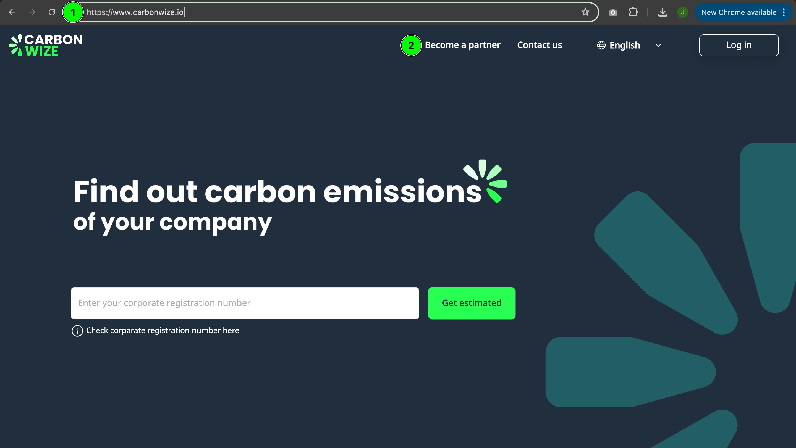

# 🔐 Forgot password

<figure><figcaption></figcaption></figure>

1. Press the Forgot your password button

<figure><figcaption></figcaption></figure>

1. Enter your email to reset your password&#x20;
2. Press the Reset password button

<figure><figcaption></figcaption></figure>

* Check your email to reset your password.

<figure><figcaption></figcaption></figure>

1. Press the Reset password button.

<figure><figcaption></figcaption></figure>

1. Enter a new password (as required below)
2. Enter to confirm your password
3. Press the reset password button

* Log in using new password only.
