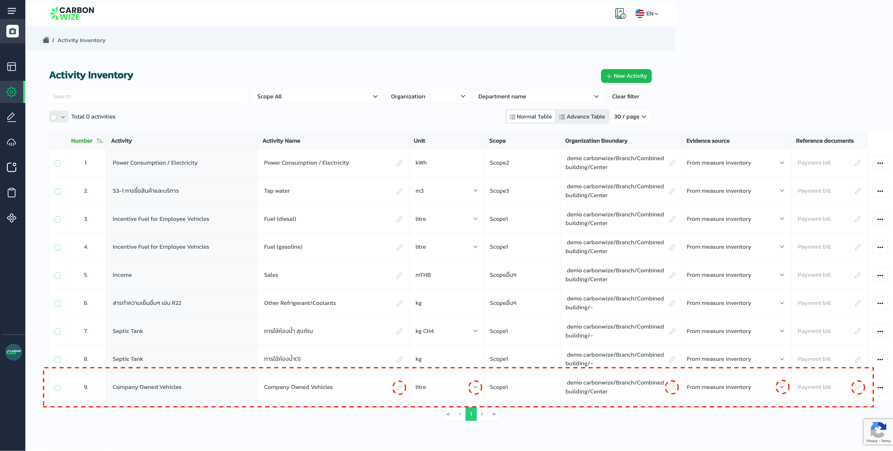

# Activity Inventory

## Steps creating an Activity Inventory

<figure><figcaption></figcaption></figure>

1. Press the settings menu
2. Press the activity menu
3. Press the new activity  button

<figure><figcaption></figcaption></figure>

#### Select the details of the organization for which you want to create an activity list.

1. Select Organization
2. Select branch
3. Select a building
4. Select department (optional)
5. Press the next button

<figure><figcaption></figcaption></figure>

1. Select industry type
2. Select an activity
3. Press the next button.


Creating an activity inventory can select more than one industry type and activity.


<figure><figcaption></figcaption></figure>

* Activity inventory created successfully

## Steps editing activity&#x20;

<figure><figcaption></figcaption></figure>

1. You can press the icon or the symbol to edit the activity list immediately.

## Steps to delete an activity  (1 item)

<figure><figcaption></figcaption></figure>

1. Check the activity list name
2. Press the icon behind the list.
3. Press the Delete button.

## Steps for deleting activity (more than 1)

<figure><figcaption></figcaption></figure>

1. Select item
2. Press the Delete button.

## Procedure for duplicating an activity list

<figure><figcaption></figcaption></figure>

1. Select item
2. Press the copy button
