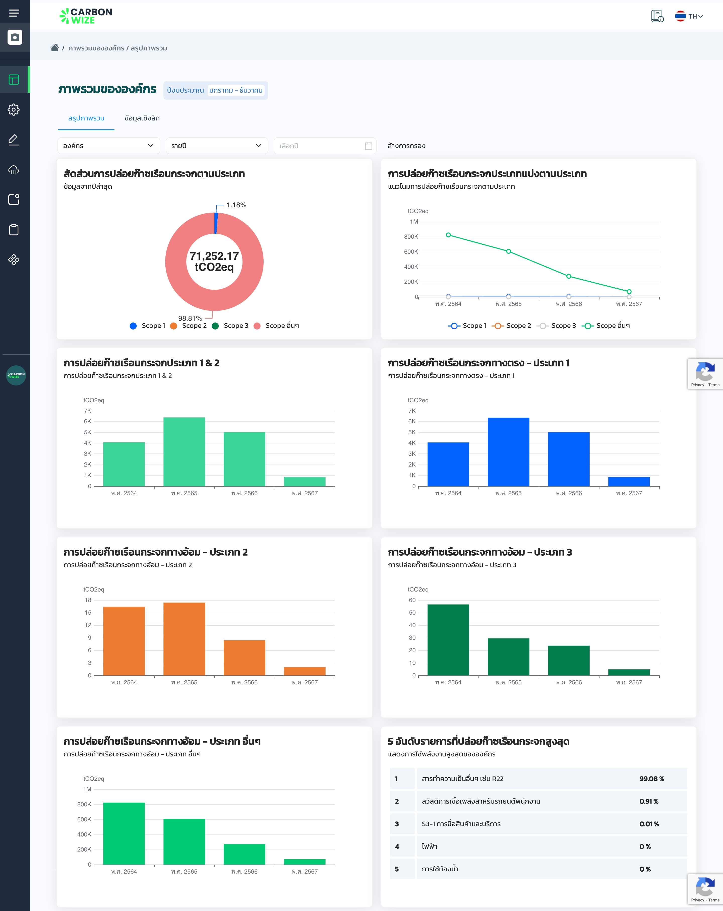
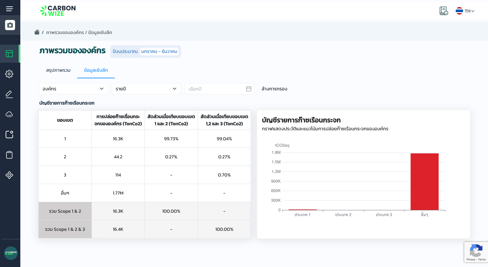

# 📈 ภาพรวมขององค์กร

<figure><figcaption></figcaption></figure>

### หน้าสรุปภาพรวม

1. แสดงข้อมูลสัดส่วนการปล่อยก๊าซเรือนกระจกตามประเภท

<figure><figcaption></figcaption></figure>

### หน้าข้อมูลเชิงลึก

1. แสดงการปล่อยก๊าซเรือนกระจกตามสัดส่วนเมื่อเทียบขอบเขต
