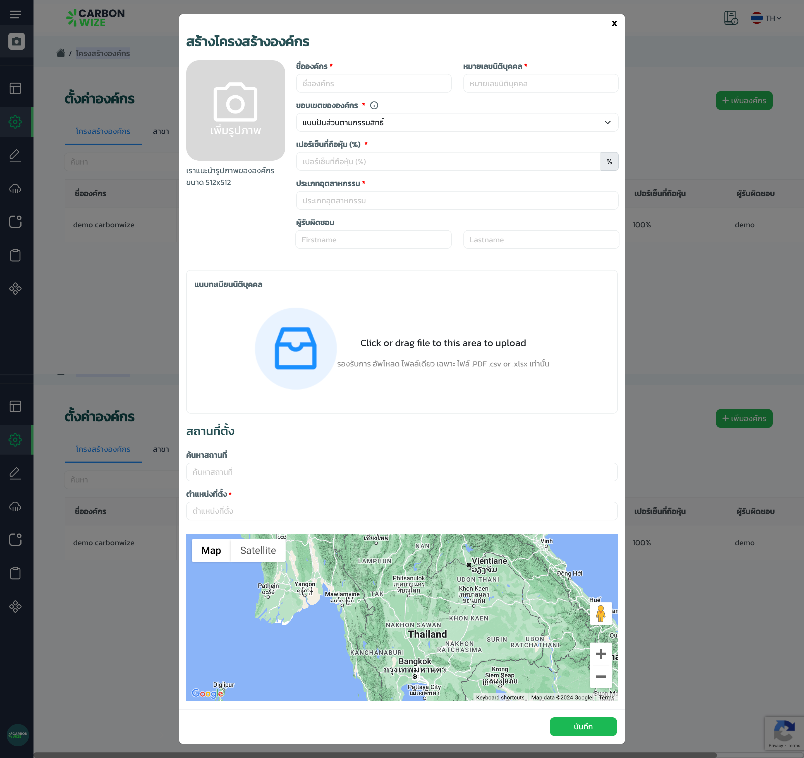
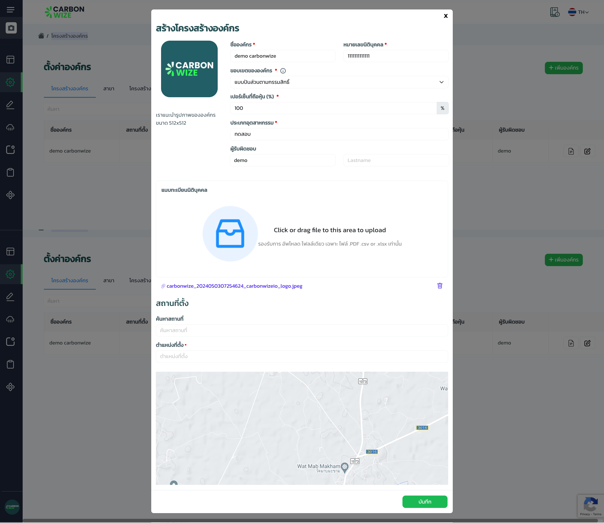

# การตั้งค่าองค์กร

## **ขั้นตอนการเพิ่มองค์กรย่อย**

<figure><figcaption></figcaption></figure>

1. กดเมนูตั้งค่าการใช้งาน
2. กดเมนูตั้งค่าองค์กร
3. กดแท็บโครงสร้างองค์กร
4. กดปุ่มเพิ่มองค์กร

<figure><figcaption></figcaption></figure>

1. กรอกรายละเอียดข้อมูลขององค์กรย่อยให้ครบถ้วน
2. กดปุ่มบันทึก

## **ขั้นตอนการแก้ไของค์กร**

<figure><figcaption></figcaption></figure>

1. กดแท็บโครงสร้างองค์กร
2. กด icon (icon edit)

<figure><figcaption></figcaption></figure>

1. แก้ไขข้อมูล
2. กดปุ่มบันทึก
