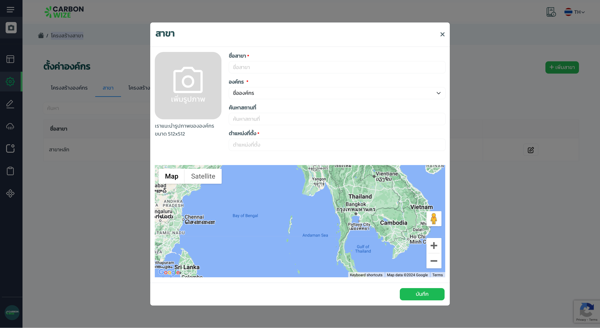
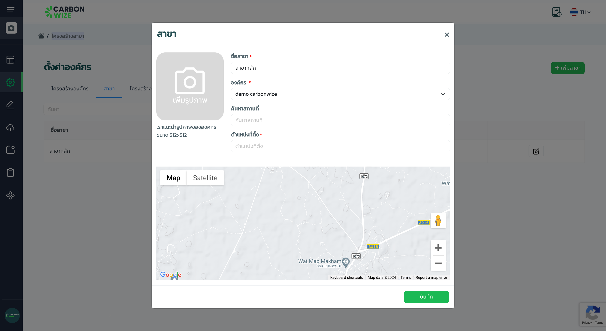

# การตั้งค่าสาขา

## **ขั้นตอนการเพิ่มสาขา**

<figure><figcaption></figcaption></figure>

1. กดเมนูตั้งค่าการใช้งาน
2. กดเมนูตั้งค่าองค์กร
3. กดแท็บสาขา
4. กดปุ่มเพิ่มสาขา

<figure><figcaption></figcaption></figure>

1. กรอกรายละเอียดข้อมูลสาขาให้ครบถ้วน
2. กดปุ่มบันทึก

## ขั้นตอนการแก้ไขสาขา

<figure><figcaption></figcaption></figure>

1. กดแท็บสาขา
2. กด icon (icon edit)

<figure><figcaption></figcaption></figure>

1. แก้ไขข้อมูล
2. กดปุ่มบันทึก
