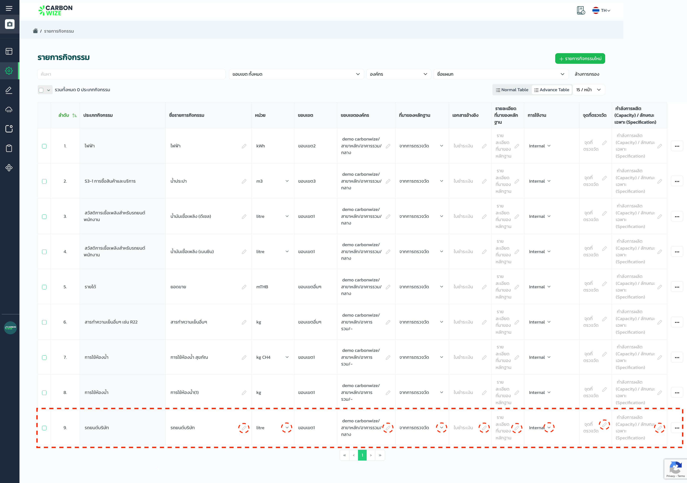

# รายการกิจกรรม

## **ขั้นตอนการสร้างรายการกิจกรรม**

<figure><figcaption></figcaption></figure>

1. กดเมนูตั้งค่าการใช้งาน
2. กดเมนูรายการกิจกรรม
3. กดปุ่มรายการกิจกรรมใหม่

<figure><figcaption></figcaption></figure>

#### เลือกรายละเอียดของบริษัท ที่ต้องการสร้างรายการกิจกรรม

1. เลือกองค์กร
2. เลือกสาขา
3. เลือกอาคาร
4. เลือกแผนก (ไม่บังคับ)
5. กดปุ่มถัดไป

<figure><figcaption></figcaption></figure>

1. เลือกประเภทอุตสาหกรรม
2. เลือกกิจกรรม
3. กดปุ่ม ถัดไป


การสร้างรายการกิจกรรม สามารถเลือกประเภทอุตสาหกรรม และ กิจกรรมได้มากกว่า 1 รายการ


<figure><figcaption></figcaption></figure>

✅ สร้างรายการกิจกรรมสำเร็จ

## ขั้นตอนการแก้ไขรายการกิจกรรม

<figure><figcaption></figcaption></figure>

1. สามารถกดที่ icon หรือ ตามสัญลักษณ์ และแก้ไขรายการกิจกรรมได้ทันที

## ขั้นตอนการลบรายการกิจกรรม (1 รายการ)

<figure><figcaption></figcaption></figure>

1. ตรวจเช็คชื่อรายการกิจกรรม
2. กด icon ด้านหลังรายการ
3. กดปุ่ม ลบ

## ขั้นตอนการลบรายการกิจกรรม (มากกว่า 1 รายการ)

<figure><figcaption></figcaption></figure>

1. เลือกรายการ
2. กดปุ่ม ลบ

## ขั้นตอนการทำสำเนารายการกิจกรรม

<figure><figcaption></figcaption></figure>

1. เลือกรายการ
2. กดปุ่มสำเนา
