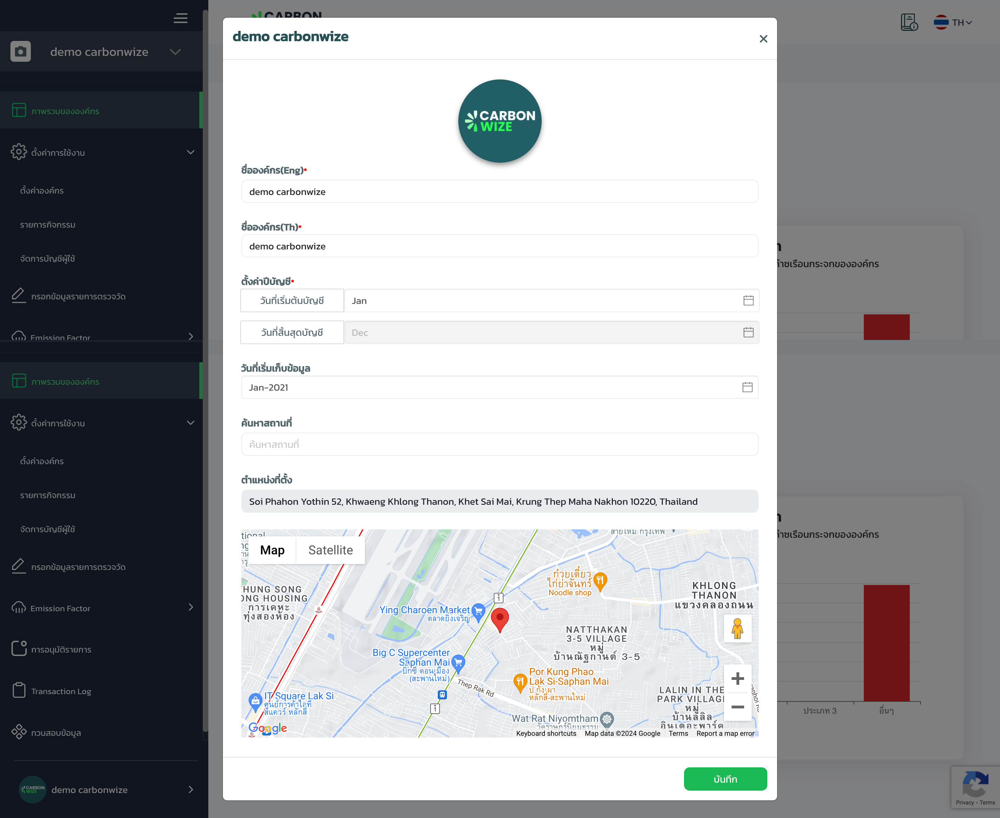

# การตั้งค่าการเก็บข้อมูลองค์กร

<figure><figcaption></figcaption></figure>

1. กดที่ icon&#x20;

<figure><figcaption></figcaption></figure>

1. แสดงข้อมูลการเก็บข้อมูลองค์กรเช่น ชื่อองค์กร, ตั้งค่าปีบัญชี, วันที่เริ่มเก็บข้อมูล และ สถานที่ตั้ง
2. สามารถแก้และบันทึกได้
